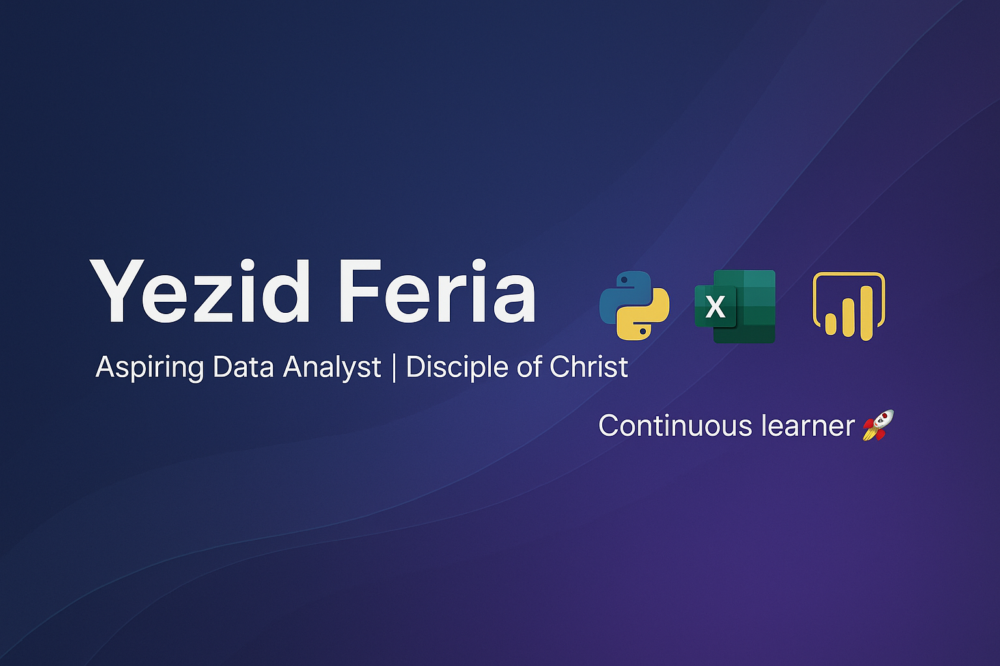

<!-- Banner -->

  

# 👋 Hi, I'm Yezid Feria  

💻 **Aspiring Data Scientist / Data Analyst in training**  
🎓 **Graduate in Logistics Administration**  
🌍 Based in Orlando, FL  
✝️ **Disciple of Christ | Lifelong Learner 🚀**

---

## 🚀 About Me  
I am passionate about **data-driven problem solving** and transforming raw information into **clear and actionable insights**.  
With a background in **Logistics Administration**, I bring analytical, organizational, and leadership skills into the world of **data science**.  

Currently, I am strengthening my knowledge in:  
- **Python** (pandas, NumPy, scikit-learn)  
- **SQL**  
- **Excel & Power BI** for data visualization  
- **Machine Learning** (Logistic Regression, Decision Trees, Random Forest, etc.)  

---

## 📂 Featured Projects  
- 📊 **[Chicago Taxi Analysis](#)** → Exploratory Data Analysis and hypothesis testing.  
- 📈 **[Customer Churn Prediction](#)** → Classification models with feature engineering.  
- 🤖 **[Plan Recommendation System](#)** → Comparison between Logistic Regression and Decision Trees.  

---

## 🌟 My Goals  
- Continue growing as a **Data Analyst / Data Scientist in training**.  
- Apply my experience in logistics and leadership to build **impactful data-driven solutions**.  
- Develop projects that combine **business context** with **technical skills**.  
- Remain a **lifelong learner**, guided by values and faith that inspire my journey ✝️.  

---

## 📫 Connect With Me  
- 💼 [[LinkedIn](https://www.linkedin.com/in/yezid-feria-0313a8309/)](#)    
- ✉️ yezid.feria@icloud.com  

---
